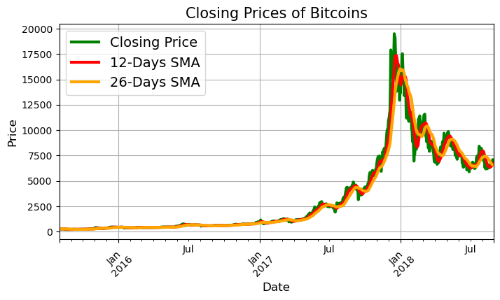
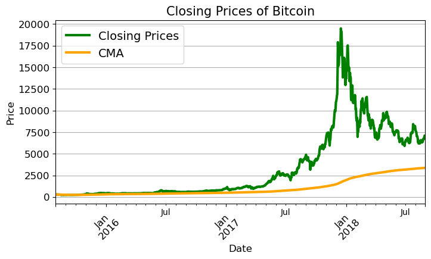
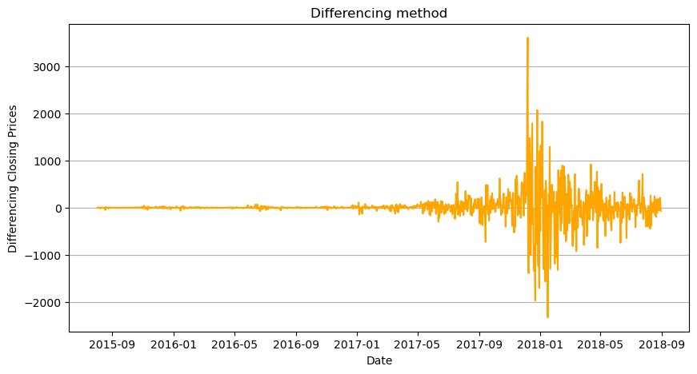

#  Motivation
The highly volatile nature of cryptocurrency market makes it an interesting environment to test popular time series models. Unlike traditional assets, cryptocurrencies lack intrinsic value, and operate without a central governing authority. Moreover, their prices are heavily influenced by human sentiment, market speculation, and evolving regulatory pressures.

##  Features
- __Moving Average__ Calculation
  - __SMA__ -> What's the average of the recent window?
  - __CMA__ -> What's the average of everything so far?
  - __EMA__ -> What's the recent trend, but with more importance on the newest data?

    
    
    

 

- __Stationarity__ Check
  - We check for stationarity because non-stationary data is unreliable for prediction.  
- __Differencing__ Method
  - When time-series data is non-stationary, we need to apply differencing to create stability for prediction.

    

 

- __Forecasting__ using __ARIMA__ Model
    - ARIMA (Autoregressive Integrated Moving Average)

    

 

##  Dataset
- __Title__:Historical Bitcoin Prices
- __Source__: Kaggle
- __Data Size__: (2042,13)
##  Libraries
- Pandas
- Numpy
- Statsmodel
- Datetime

##  Insights
- We learned that the historical bitcoin prices are non-stationary.
- From 2017, the bitcoin prices started to rise, and the price rose significantly until January 2018, with seasonal decrease.
- This increase in bitcoin prices at the end of 2017 can be attributed to excessive media coverage, limited supply, fear of missing out and overall growth in crypto industry.
- Since January 2018, the price started to fall, with seasonal increase.
