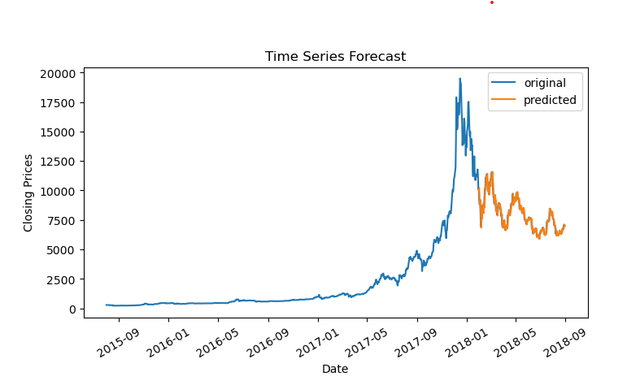

#  Timeseries-Analysis-Historical-Bitcoin-Prices
*This project explores historical Bitcoin price patterns through time series analysis and forecasting techniques. The analysis reveals key insights into Bitcoin's price behavior, including its non-stationary nature and the dramatic bull run of late 2017.*

    
    

 

##  Objectives
- Calculate Simple, Cumulative and Exponential Moving Averages.
- Check for Stationarity in the data.
- Apply ARIMA model for forecasting.

##  Dataset
- __Title__:Historical Bitcoin Prices
- __Source__: Kaggle
- __Data Size__: (2042,13)
##  Libraries
- Pandas
- Numpy
- Statsmodel

##  Evaluation Metrices
- ADF (Augmented Dickey-Fuller) Test to check statinarity. 

##  Insights
- We learned that the historical bitcoin prices are non-stationary.
- From 2017, the bitcoin prices started to rise, and the price rose significantly until January 2018, with seasonal decrease.
- This increase in bitcoin prices at the end of 2017 can be attributed to excessive media coverage, limited supply, fear of missing out and overall growth in crypto industry.
- Since January 2018, the price started to fall, with seasonal increase.
